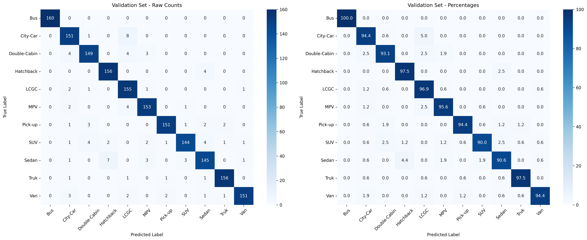
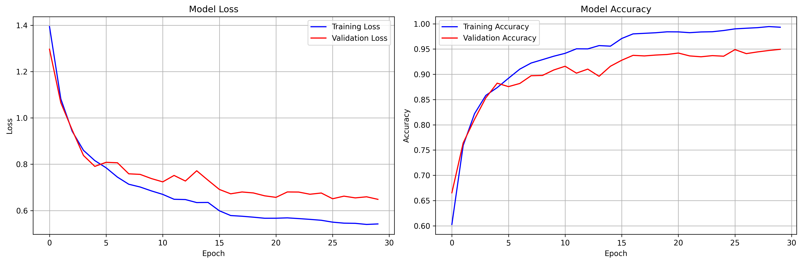

# Vehicle Detection with YOLOv12n + ResNet18


## Overview

This project implements a robust vehicle detection and classification pipeline using YOLOv12n for object detection and ResNet18 for vehicle type classification. The system is designed for real-time video processing and supports both advanced (DeepSORT) and simple tracking options.

---

## Features

- **Vehicle Detection**: Fast and accurate detection using YOLOv12n.
- **Vehicle Classification**: Classifies detected vehicles into 11 categories using a ResNet18-based classifier.
- **Tracking**: Supports both DeepSORT and a simple centroid tracker.
- **Flexible Pipeline**: Can run detection-only, detection+classification, and with/without real-time display.

---

## Training Results

### Vehicle Classifier (ResNet18)

- **Classes**: Bus, City-Car, Double-Cabin, Hatchback, LCGC, MPV, Pick-up, SUV, Sedan, Truk, Van
- **Training Set Size**: 7,040 images
- **Validation Set Size**: 1,760 images
- **Final Validation Accuracy**: **94.94%**
- **Average Precision**: 0.9503
- **Average Recall**: 0.9494
- **Average F1-Score**: 0.9495

**Confusion Matrix:**


**Training History:**


---

*For more details, see `classifier_finetune/logs/vehicle_classifier_resnet_20250619_214824.log`.*

---

## Object Detection Model

- **Model**: YOLOv12n

**Training Results:**


---

## How to Run

### 1. Install Requirements

If you have CUDA Installed
```bash
pip install torch torchvision torchaudio --index-url https://download.pytorch.org/whl/cu128
```
```bash
pip install -r requirements.txt
```

#### Download Pre-trained Models

**Vehicle Classifier Model:**
- Download from: https://drive.google.com/file/d/1GIPpAT8XToLvSl4nFd1a0rboolKaXvR0/view?usp=drive_link
- Place the file in: `video_pipeline/classifier_model/vehicle_classifier_resnet_20250619_222145.pth`

**Object Detection Model:**
- Download from: https://drive.google.com/file/d/1qK-hC_36A58VjrpH0CmAYv9YqJsi8fQY/view?usp=drive_link
- Place the file in: `video_pipeline/det_model/yolo12_fine_tuned.pt`

### 3. Run the Pipeline

The main entry point for the pipeline is `video_pipeline/main.py`. You can run the pipeline in several modes:

#### Real-time Mode with DeepSORT

```bash
python video_pipeline/main.py video_pipeline/inputs/traffic_test.mp4 --classifier-model video_pipeline/classifier_model/vehicle_classifier_resnet_20250619_222145.pth --yolo-model video_pipeline/det_model/yolo12_fine_tuned.pt
```

- Runs with real-time display and classification.

#### Simple Tracker Mode

```bash
python video_pipeline/main.py video_pipeline/inputs/traffic_test.mp4 --simple-tracker --classifier-model video_pipeline/classifier_model/vehicle_classifier_resnet_20250619_222145.pth --yolo-model video_pipeline/det_model/yolo12_fine_tuned.pt
```

- Uses a simple centroid tracker instead of DeepSORT.

#### Detection Only (No Classifier)

```bash
python video_pipeline/main.py video_pipeline/inputs/traffic_test_10s.mp4 --yolo-model video_pipeline/det_model/yolo12_fine_tuned.pt
```

- Runs detection and tracking only, without vehicle type classification.

**Other options:**  
- `--display` to show video output during processing  
- `--output` to specify output video path  
- `--conf-threshold` to set detection confidence threshold  
- `--device` to select device (`auto`, `cpu`, `cuda`)

---

## Directory Structure

- `classifier_finetune/` – Classifier training scripts, logs, and models
- `yolo_finetune/` – YOLO training scripts and datasets
- `video_pipeline/` – Main pipeline code and utilities
  - `classifier_model/` – Pre-trained vehicle classifier models
  - `det_model/` – Pre-trained YOLO detection models
  - `inputs/` – Input video files
  - `outputs/` – Processed video outputs
- `assets/` – Demo GIFs and media

---

## Acknowledgements

- YOLOv12n: [YOLO official repo](https://github.com/ultralytics/yolov5)
- ResNet18: [PyTorch Models](https://pytorch.org/vision/stable/models.html)

---
